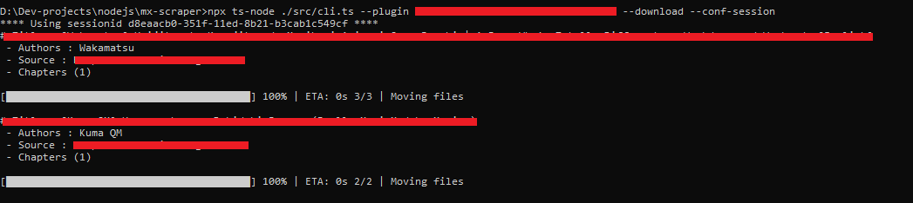

# mx-scraper
mx-scraper (Manga Xtreme Scraper) is an opensource Manga website scraper.


## Build
```
# build
npx tsc

# build and watch
npm start

# Packaging
```
You must change the target platform in your package.json first 
npm run build
```

## Test
```
npm test
```

## Sandbox tests examples
```
npm run ts-node src/sandbox/flare-session.ts
```

## CLI examples
```
mx-scraper --help --verbose
mx-scraper --show-plugins -v
mx-scraper --show-plugins -v -cs
mx-scraper --search-plugin -v http://link/to/a/title
mx-scraper -h -v
npx ts-node ./src/cli.ts -help --verbose
npx ts-node ./src/cli.ts -sp
mx-scraper --auto --fetch http://link/to/a/title
mx-scraper --plugin plugin_name --fetch-all title1 title2 title3
mx-scraper --plugin plugin_name --fetch-all 420166 420132 --download --conf-session
mx-scraper --plugin plugin_name --fetch-all --download 420166 420132
```