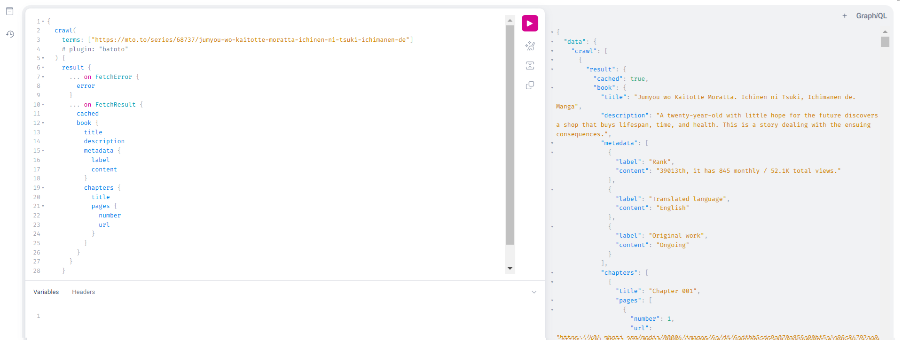

# mx-scraper

Download image galleries or metadata on the web.

> This rewrite is expected to support previous implementation's metadata format.
>
> The main idea was to separate the core (mx-scraper) from the plugins (user
> defined) as it was not possible from previous implementations.

# Usage

```bash
# pip install beautifulsoup4

# The `images` plugin uses bs4
# This will for example download all image links using the `images` plugin.
mx-scraper fetch https://www.google.com --plugin images -v

# Alternatively, for batched terms targeting various sources, prefixing is often required (e.g. id or name)
mx-scraper fetch --meta-only -v img:https://www.google.com https://mto.to/series/68737
mx-scraper fetch --meta-only -v nh:177013
mx-scraper fetch --meta-only -v https://twitter.com/imigimuru/status/1829913427373953259
```

## Commands

```bash
mx-scraper engine

Usage: mx-scraper <COMMAND>

Commands:
  fetch        Fetch a sequence of terms
  fetch-files  Fetch a sequence of terms from a collection of files
  request      Request a url
  infos        Display various informations
  server       Spawn a graphql server
  help         Print this message or the help of the given subcommand(s)

Options:
  -h, --help  Print help
```

Each fetch strategy will share the same configuration..

# Features

- [x] CLI
  - [x] Fetch a list of terms
  - [x] Fetch a list of terms from a collection of files⌈
  - [x] Generic URL Request
    - [x] Print as text
    - [x] Download `--dest` flag
  - [x] Authentications (Basic, Bearer token)

- [x] Cookies
  - [x] Loading from a file (Netscape format, key-value)
  - [x] Loading from the config (key-value)

- [x] Downloader
  - [x] Support of older mx-scraper book schema
  - [x] Download
  - [x] Cache support (can be disabled with `--no-cache` or from config)

- [ ] Plugins
  - [x] Python plugin
    - [x] `MxRequest` with runtime context (headers, cookies, auth)
  - [x] gallery-dl extractors
  - [ ] Subprocess (e.g. imgbrd-grabber)

- [ ] HtmlParser (optional feature)
  - [ ] Implement `HtmlParser.use(source).where('attr.href = ..')`
  - [ ] Wrap into a python class

# GraphQL server

You can also use the extractors through GraphQL queries. You will have the same
options as the command-line interface.

```
Usage: mx-scraper server [OPTIONS]

Options:
      --port <PORT>  Server port
  -h, --help         Print help
```


